# Structure PLP-SLAM: Efficient Sparse Mapping and Localization using Point, Line and Plane for Monocular, RGB-D and Stereo Cameras

### License Issue

* Notice that this work is based on the original OpenVSLAM (renamed now as stella-vslam), which is a derivative work of ORB-SLAM2 without any modification to core algorithms. It was declared in conflict with ORB-SLAM2 (see: https://github.com/stella-cv/stella_vslam/issues/249).

* For the courtesy of ORB-SLAM2, the granted license of this project is **GNU General Public License v3.0**. For commercial purposes of this project, please contact department Augmented Vision (https://www.dfki.de/en/web/research/research-departments/augmented-vision), DFKI (German Research Center for Artificial Intelligence), Germany.

* If you have any **technical questions** regarding to the implementation, please kindly leave an issue.

## Related Papers:

[1] F. Shu, et al. "Structure PLP-SLAM: Efficient Sparse Mapping and Localization using Point, Line and Plane for Monocular, RGB-D and Stereo Cameras". IEEE International Conference on Robotics and Automation (ICRA), 2023. (https://arxiv.org/abs/2207.06058) **updated arXiv v3 with supplementary materials.**

[2] F. Shu, et al. "Visual SLAM with Graph-Cut Optimized Multi-Plane Reconstruction." International Symposium on Mixed and Augmented Reality (ISMAR, poster). IEEE, 2021. (https://arxiv.org/abs/2108.04281)

[3] Y. Xie, et al. "PlaneRecNet: Multi-Task Learning with Cross-Task Consistency for Piece-Wise Plane Detection and Reconstruction from a Single RGB Image." British Machine Vision Conference (BMVC), 2021. (https://arxiv.org/abs/2110.11219)

## Video
[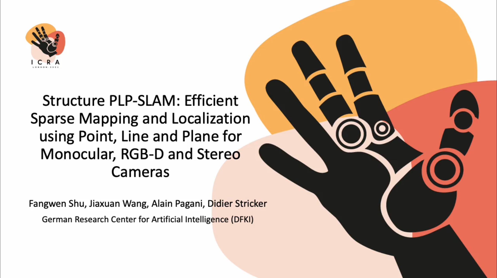](video/ICRA23_0006.mp4)


## The System Workflow: 
    
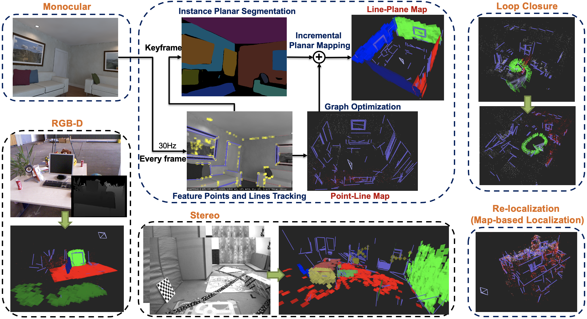

## Qualitative Illustration:

### Monocular: 

* fr3_structure_texture_far (dataset TUM RGB-D)

     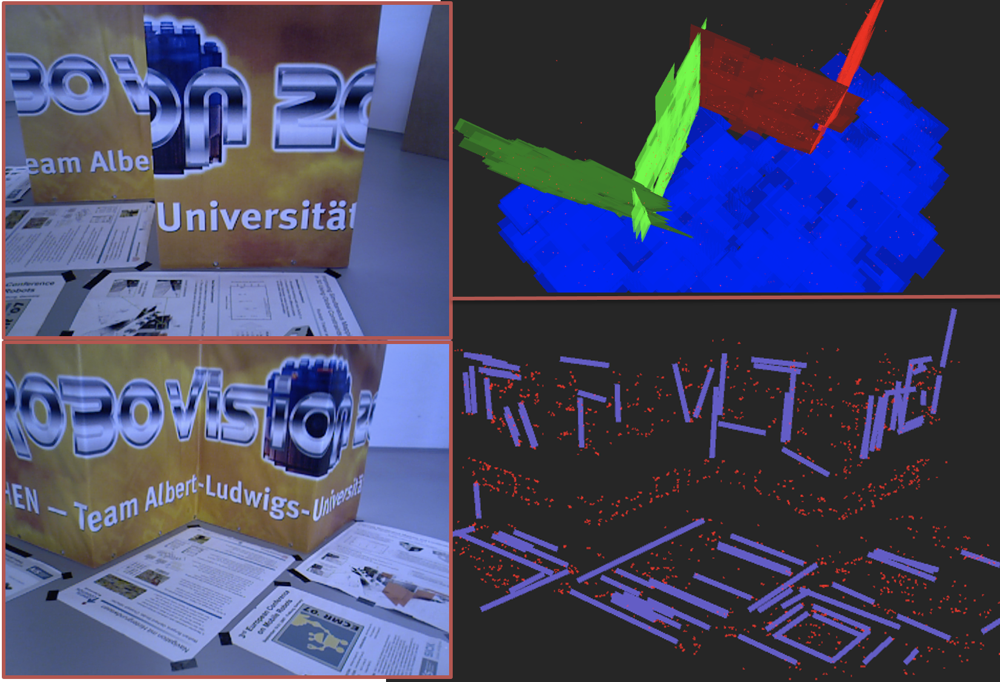

* living_room_traj0 and living_room_traj2 (dataset ICL-NUIM)

    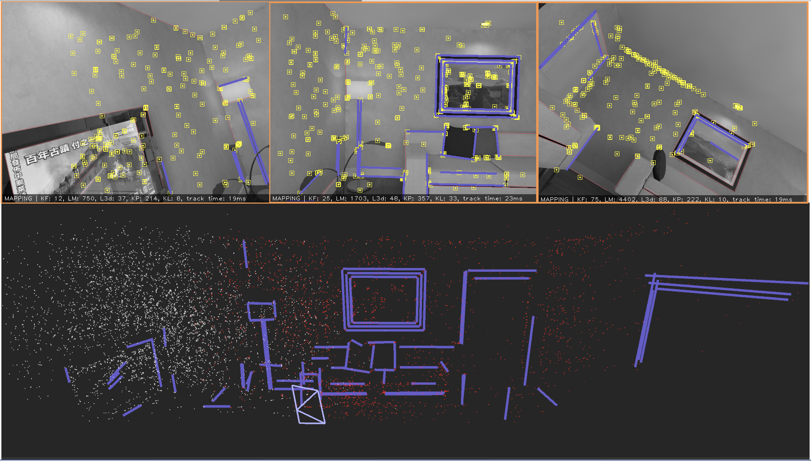
    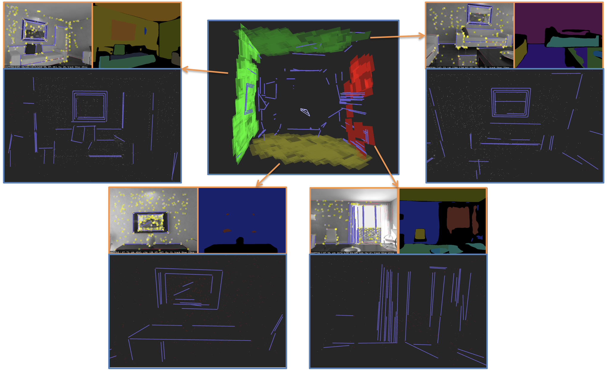

* MH_04_difficult (dataset EuRoC MAV)

    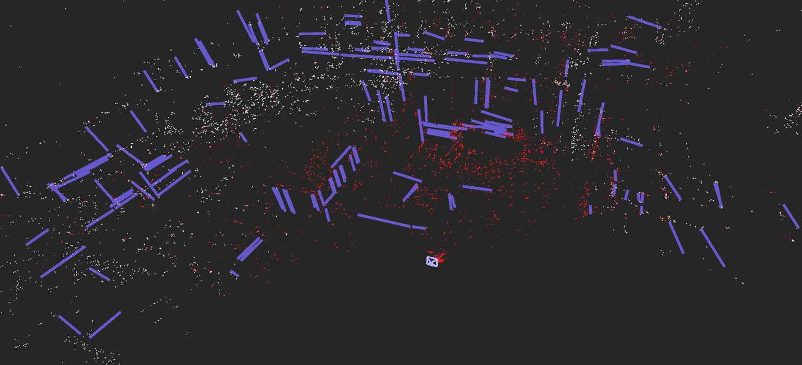

* Sequence_00 (data_odometry_gray, dataset KITTI)

    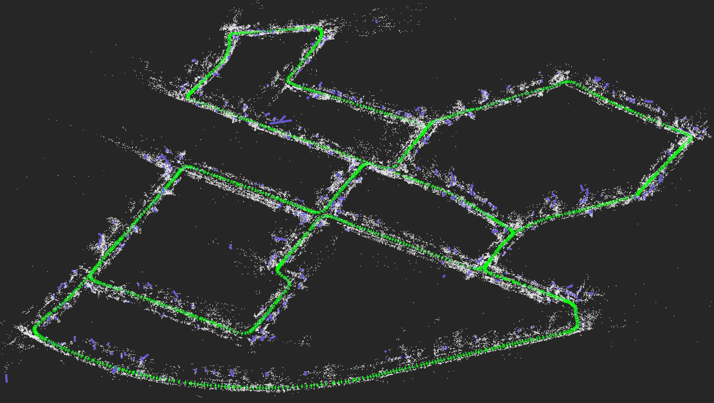

### RGB-D:
* fr2_pioneer_slam (dataset TUM RGB-D)

    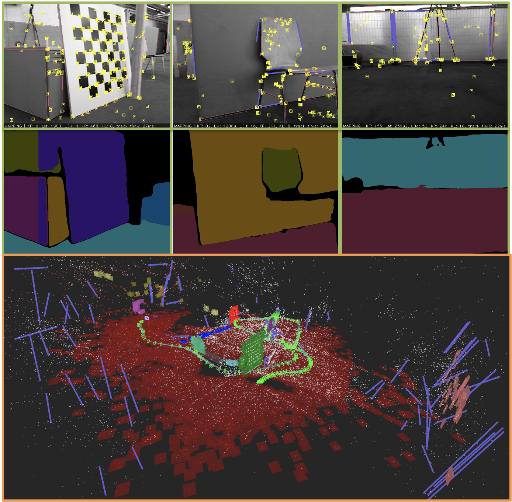

* office_room_traj0 (dataset ICL-NUIM)

    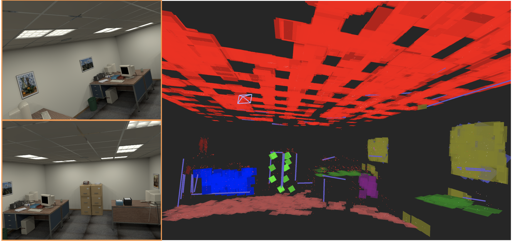

### Stereo:
* MH_04_difficult (dataset EuRoC MAV)

    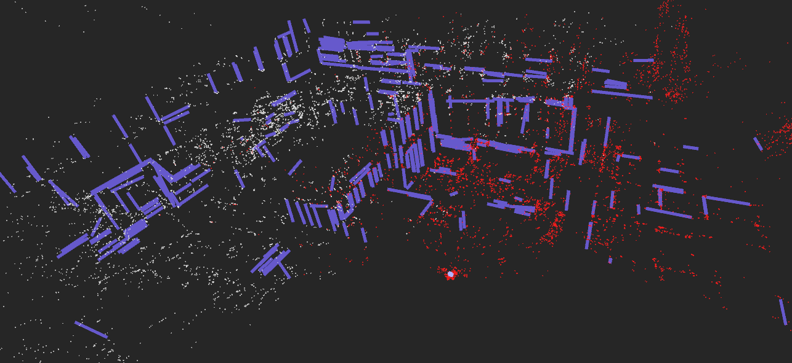

* V1_03_difficult (dataset EuRoC MAV)

    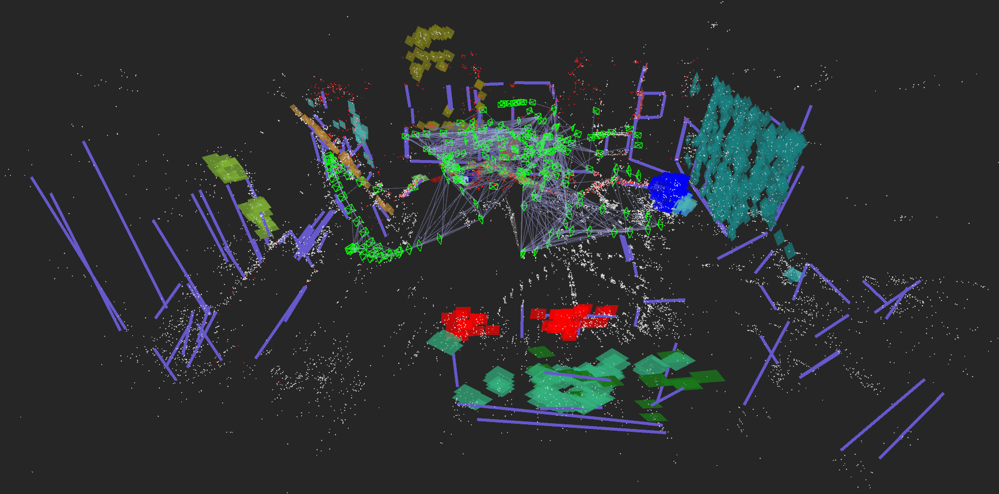


## Some Remarks

* Point-Line SLAM is generalized. It can be conducted on all kind of data image sequences.
* For running Planar SLAM, segmentation needs to be done beforehand (see details in below).
* ORB vocabulary is already attached to this repository, see: ./orb_vocab/

## Build with PangolinViewer (Default)

```
The structure-plp-slam code is based on a relatively old version of OpenVSLAM (from early 2021 I think).

You should be able to find everything you need in this documentation:
https://stella-cv.readthedocs.io/en/0.3.9/example.html 

Notice the version of this documentation is 0.3.9 which should be the corresponding one to my version of code. Do not use the latest documentation for the revised Stella-slam.
```

### Dependencies:

* For utilizing line segment (LSD + LBD): we develop the code using OpenCV 3.4.6, in which we restored the implementation of **LSD** because it was removed. Hence, if you use OpenCV 3+, you may need to restore the LSD code yourself. 

    **However, later version of OpenCV restored the LSD (e.g. OpenCV 3.4.16 should work).**

* Other dependencies (g2o, Eigen3, Pangolin, DBoW2, Ubuntu 18.04) are in general similar to ORB-SLAM2.

* We integrated **Graph-Cut RANSAC** C++ implementation to our project, which is under BSD license. See https://github.com/danini/graph-cut-ransac.

* This project does **not** support using **ROS** and **Docker**, at least we haven't tested, for now.

* An additional plane detector:

    This work take PlaneRecNet [3] as the instance planar segmentation CNN (only instance segmentation is used, predicted depth is not used by far). Example segmentation images for different datasets will be provided with a downloading link, see section below -> **Run Point-Plane SLAM**.

    You could also segment images yourself, code please see: https://github.com/EryiXie/PlaneRecNet

### Build using CMake:

```
mkdir build && cd build

cmake \
    -DBUILD_WITH_MARCH_NATIVE=ON \
    -DUSE_PANGOLIN_VIEWER=ON \
    -DUSE_SOCKET_PUBLISHER=OFF \
    -DUSE_STACK_TRACE_LOGGER=ON \
    -DBOW_FRAMEWORK=DBoW2 \
    -DBUILD_TESTS=OFF \
    ..

make -j4
```

(or, highlight and filter (gcc) compiler messages)
```
make -j4 2>&1 | grep --color -iP "\^|warning:|error:|"
make -j4 2>&1 | grep --color -iP "\^|error:|"
```

### Command options to run the example code on standard dataset, e.g. TUM-RGBD:

```
$ ./build/run_tum_rgbd_slam
Allowed options:
  -h, --help             produce help message
  -v, --vocab arg        vocabulary file path
  -d, --data-dir arg     directory path which contains dataset
  -c, --config arg       config file path
  --frame-skip arg (=1)  interval of frame skip
  --no-sleep             not wait for next frame in real time
  --auto-term            automatically terminate the viewer
  --debug                debug mode
  --eval-log             store trajectory and tracking times for evaluation
  -p, --map-db arg       store a map database at this path after SLAM
```

## Known Issues
* If you have a crash right after running SLAM (e.g. a segmentation error), try to de-activate **BUILD_WITH_MARCH NATIVE** (in **ccmake .**). This is due to the wrong version of g2o.
    
    **You could find my version of g2o and DBoW in the link:** https://1drv.ms/u/s!Atj7rBR0X5zagZwcFs1oIqXeV5r4Cw?e=pbnNES

* Visualization issue if you are running latest Ubuntu 20 or 22. As this codebase was developed with Ubuntu 18. When you run the code, the camera maybe not following the tracking path, see: https://github.com/PeterFWS/Structure-PLP-SLAM/issues/8


## Standard SLAM with Standard Datasets

### (1) TUM-RGBD dataset (monocular/RGB-D):

```
./build/run_tum_rgbd_slam \
-v ./orb_vocab/orb_vocab.dbow2 \
-d /data/TUM_RGBD/rgbd_dataset_freiburg3_long_office_household \
-c ./example/tum_rgbd/TUM_RGBD_mono_3.yaml
```

### (2) KITTI dataset (monocular/stereo):

```
./build/run_kitti_slam \
-v ./orb_vocab/orb_vocab.dbow2 \
-d /data/KITTI/odometry/data_odometry_gray/dataset/sequences/00/ \
-c ./example/kitti/KITTI_mono_00-02.yaml
```

### (3) EuRoC MAV dataset (monocular/stereo)

```
./build/run_euroc_slam \
-v ./orb_vocab/orb_vocab.dbow2 \
-d /data/EuRoC_MAV/MH_01_easy/mav0 \
-c ./example/euroc/EuRoC_mono.yaml
```
## Run Point-Line SLAM
### (1) TUM RGB-D (monocular/RGB-D)

```
./build/run_tum_rgbd_slam_with_line \
-v ./orb_vocab/orb_vocab.dbow2 \
-d /data/TUM_RGBD/rgbd_dataset_freiburg3_long_office_household \
-c ./example/tum_rgbd/TUM_RGBD_mono_3.yaml
```

### (2) ICL-NUIM (monocular/RGB-D)

```
./build/run_tum_rgbd_slam_with_line \
-v ./orb_vocab/orb_vocab.dbow2 \
-d /data/ICL_NUIM/traj3_frei_png \
-c ./example/icl_nuim/mono.yaml
```

### (3) EuRoc MAV (monocular/stereo)

```
./build/run_euroc_slam_with_line \
-v ./orb_vocab/orb_vocab.dbow2 \
-d /data/EuRoC_MAV/MH_04_difficult/mav0 \
-c ./example/euroc/EuRoC_mono.yaml
```

### (4) KITTI (monocular/stereo)

```
./build/run_kitti_slam_with_line \
-v ./orb_vocab/orb_vocab.dbow2 \
-d /data/KITTI/odometry/data_odometry_gray/dataset/sequences/00/ \
-c ./example/kitti/KITTI_mono_00-02.yaml
```

## Run Re-localization (Map-based Image Localization) using Pre-built Map

First, pre-build a map using (monocular or RGB-D) SLAM:
```
./build/run_tum_rgbd_slam_with_line \
-v ./orb_vocab/orb_vocab.dbow2 \
-d /data/TUM_RGBD/rgbd_dataset_freiburg3_long_office_household \
-c ./example/tum_rgbd/TUM_RGBD_rgbd_3.yaml \
--map-db freiburg3_long_office_household.msg
```

Second, run the (monocular) image localization mode, notice that give the path to the RGB image folder:
```
./build/run_image_localization_point_line \
-v ./orb_vocab/orb_vocab.dbow2 \
-i /data/TUM_RGBD/rgbd_dataset_freiburg3_long_office_household/rgb \
-c ./example/tum_rgbd/TUM_RGBD_mono_3.yaml \
--map-db freiburg3_long_office_household.msg
```

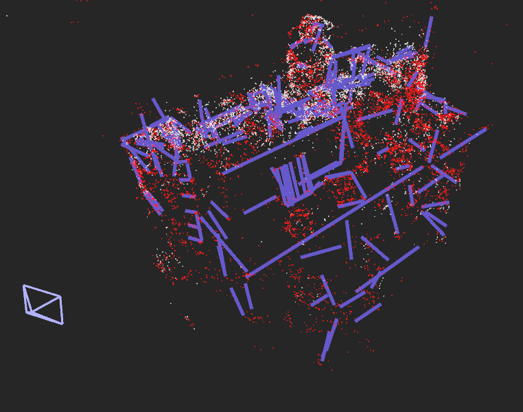

## Run Point-Plane SLAM (+ Line if Activated, see: planar_mapping_parameters.yaml)

* We provide instance planar segmentation masks and *.txt file, which can be **download** here (OneDrive shared): 
    
    https://1drv.ms/u/s!Atj7rBR0X5zagZwcFs1oIqXeV5r4Cw?e=pbnNES

* TUM RGB-D dataset, besides the folder which saves rgb image, you need to provide folder which saves the segmentation masks and a mask.txt file.
    ```
    ./data/TUM_RGBD/rgbd_dataset_freiburg3_long_office_household/
    |
    |____./rgb/
    |____./depth/
    .
    |____./rgb.txt
    .
    .
    |____./mask/              % given by our download link
    |____./mask.txt           % given by our download link
    ```

* ICL-NUIM dataset, we customize it the same way as TUM RGB-D dataset.
    ```
    ./data/ICL_NUIM/living_room_traj0_frei_png/
    |
    |____./rgb/
    |____./depth/
    .
    .
    |____./mask/              % given by our download link
    .
    |____./rgb.txt            % given by our download link
    |____./depth.txt          % given by our download link
    |____./mask.txt           % given by our download link
    |____./associations.txt   % given by our download link
    |____./groundtruth.txt    % given by our download link
    ```

* EuRoC MAV dataset, we provide necessary segmentation masks in the downloading link, save the segmentation masks under folder **cam0**, e.g.:

    ```
    /data/EuRoC_MAV/V1_02_medium/mav0/cam0/seg/   % given by our download link
    ```

## Run SLAM with Piece-wise Planar Reconstruction 

* Mapping parameters can be adjusted, see **planar_mapping_parameters.yaml**.

### (1) TUM RGB-D (monocular/RGB-D)

```
./build/run_slam_planeSeg \
-v ./orb_vocab/orb_vocab.dbow2 \
-d /data/TUM_RGBD/rgbd_dataset_freiburg3_structure_texture_far \
-c ./example/tum_rgbd/TUM_RGBD_mono_3.yaml
```

### (2) ICL-NUIM (monocular/RGB-D)

```
./build/run_slam_planeSeg \
-v ./orb_vocab/orb_vocab.dbow2 \
-d /data/ICL_NUIM/living_room_traj0_frei_png \
-c ./example/icl_nuim/mono.yaml
```

### (3) EuRoc MAV (monocular/stereo): 
Only V1 and V2 image sequences, due to segmentation CNN failure on factory data sequences MH_01-05, as mentioned in the paper [1].

```
./build/run_euroc_slam_planeSeg \
-v ./orb_vocab/orb_vocab.dbow2 \
-d /data/EuRoC_MAV/V1_01_easy/mav0 \
-c ./example/euroc/EuRoC_stereo.yaml
```

## Activate Depth-based Dense Reconstruction

It can be easily activated in **planar_mapping_parameters.yaml** -> **Threshold.draw_dense_pointcloud: true**. 

This is a toy demo (RGB-D only).

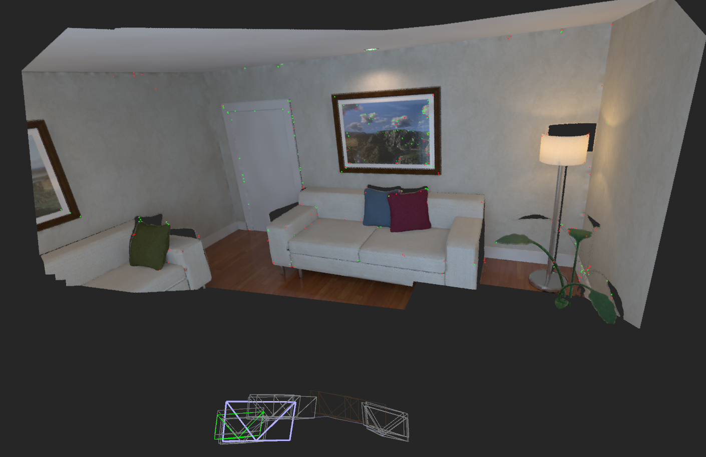


## Evaluation with EVO tool (https://github.com/MichaelGrupp/evo)

```
evo_ape tum /data/TUM_RGBD/rgbd_dataset_freiburg3_structure_texture_far/groundtruth.txt ./keyframe_trajectory.txt -p --plot_mode=xy -a --verbose -s
```

Important flags:
```
--align or -a = SE(3) Umeyama alignment (rotation, translation)
--align --correct_scale or -as = Sim(3) Umeyama alignment (rotation, translation, scale)
--correct_scale or -s = scale alignment
```

## Debug with GDB

```
gdb ./build/run_slam_planeSeg

run -v ./orb_vocab/orb_vocab.dbow2 -d /data/TUM_RGBD/rgbd_dataset_freiburg3_structure_texture_far -c ./example/tum_rgbd/TUM_RGBD_rgbd_3.yaml
```
